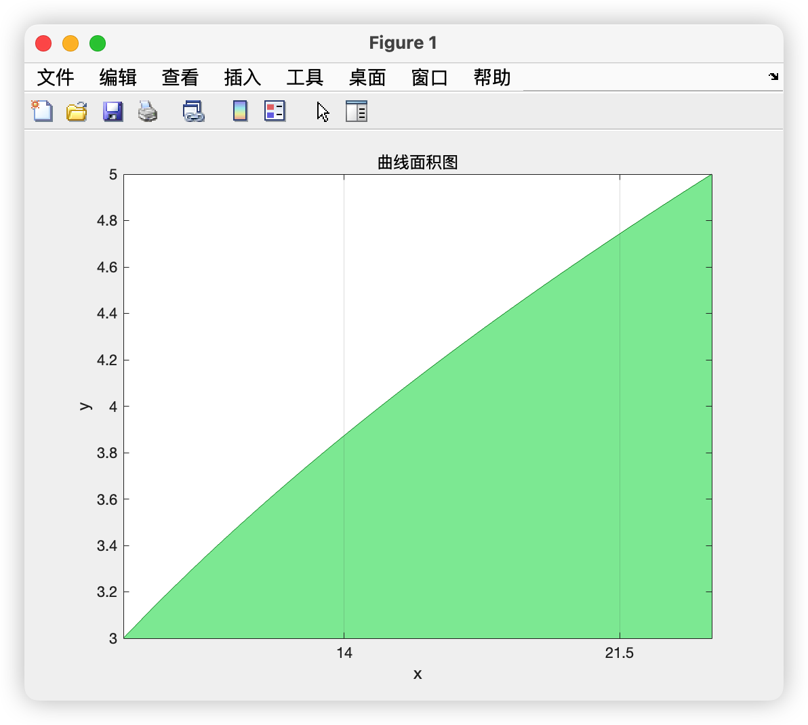
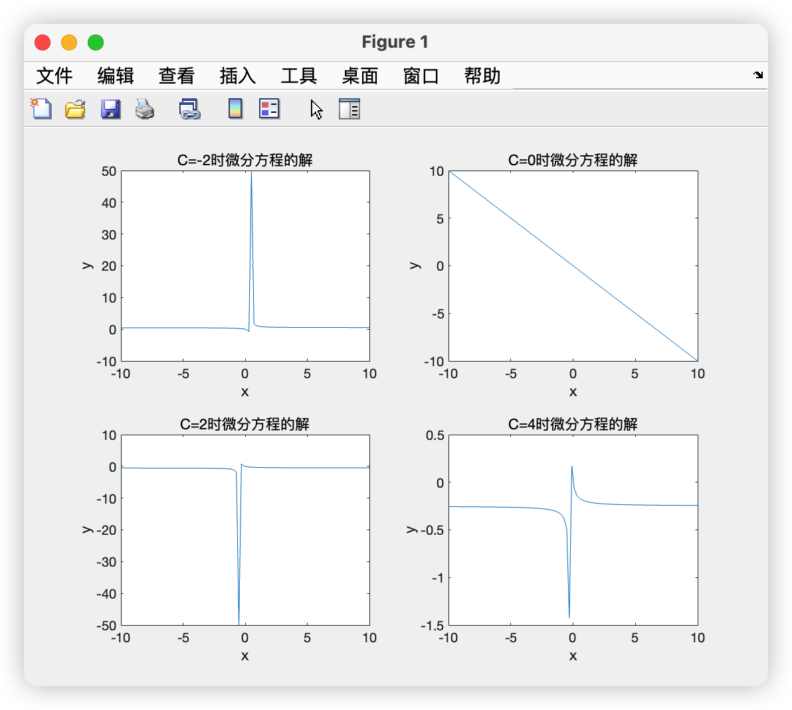
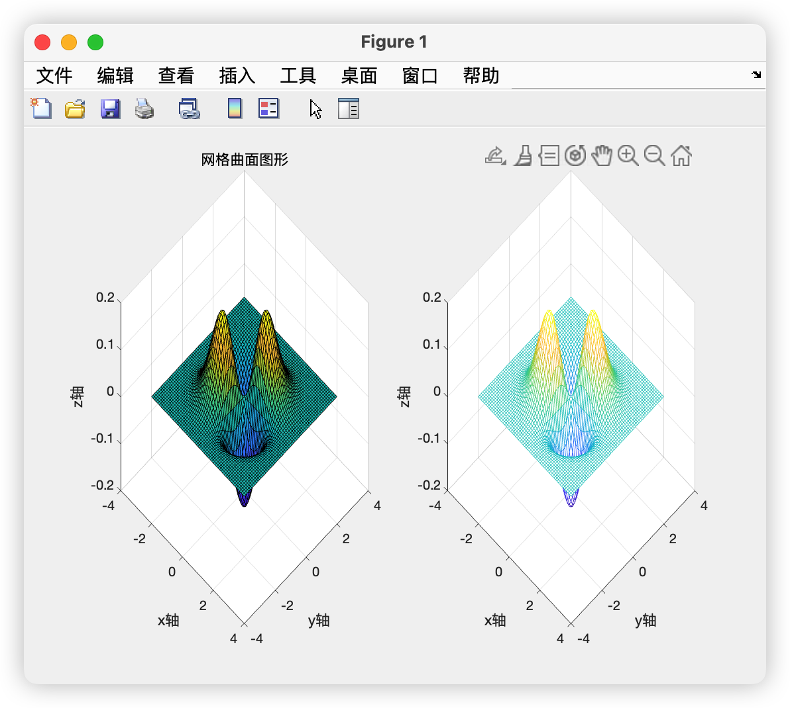

#  大数据可视化：实验四 Matlab可视化(2D和3D)

| 课程 | 大数据可视化 |
| ---- | ------------ |
| 学号 | 32001261     |
| 姓名 | 舒恒鑫       |
| 班级 | 计算机2004   |

## 实验内容

1. 绘制曲线 $y=\sqrt{x+1}$ 在 $y=3$ 与 $y=5$ 之间的面积图
2. 利用分离变量求解常微分方程 $x^2{y}'+y^2=0.$ 在通解中，分别取任意常量 $C=-2,0,2,4.$ 并绘制 $2*2$ 型的多图来展示方程的解。
3. 分别利用网格和网面生成函数 $z=xye^{-x^2-y^2}$ 的曲面图形，并采用方位角、仰角均为 45 度的视角输出图形。

## 结果分析

### Answer01

```matlab
x = linspace(-1, 30, 100);
y = sqrt(x + 1);

area(x, y, 'FaceColor', [0.5 0.9 0.6], 'EdgeColor', [0 0.5 0.1]);

ax = gca; % current axes
ax.YLim = [3,5];
ax.XTick = linspace(-1, 29, 5);
ax.XGrid = 'on';
ax.Layer = 'top';

title('曲线面积图')
xlabel('x')
ylabel('y')
```



### Answer02

```matlab
y = dsolve('x^2*Dy+y^2=0', 'x');
y = simplify(y); %化简: y = -x/(C1*x + 1)

x = linspace(-10, 10, 100);
y1 = -x./(-2*x+1);
y2 = -x;
y3 = -x./(2*x+1);
y4 = -x./(4*x+1);

subplot(2,2,1);
plot(x, y1)
title('C=-2时微分方程的解')
xlabel('x')
ylabel('y')

subplot(2,2,2);
plot(x, y2)
title('C=0时微分方程的解')
xlabel('x')
ylabel('y')

subplot(2,2,3);
plot(x, y3)
title('C=2时微分方程的解')
xlabel('x')
ylabel('y')

subplot(2,2,4);
plot(x, y4)
title('C=4时微分方程的解')
xlabel('x')
ylabel('y')
```



### Answer03

```matlab
[x,y] = meshgrid(-3:0.1:3);  % 快速生成网格所需的数据
z = x .* y .* exp(-x.^2-y.^2);

subplot(1, 2, 1)
surf(x, y, z)
view(45, 45);
title('网格曲面图形')
xlabel('x轴');  ylabel('y轴');  zlabel('z轴');

subplot(1, 2, 2)
mesh(x, y, z)
view(45, 45);
title('网线曲面图形')
xlabel('x轴');  ylabel('y轴');  zlabel('z轴');
```

