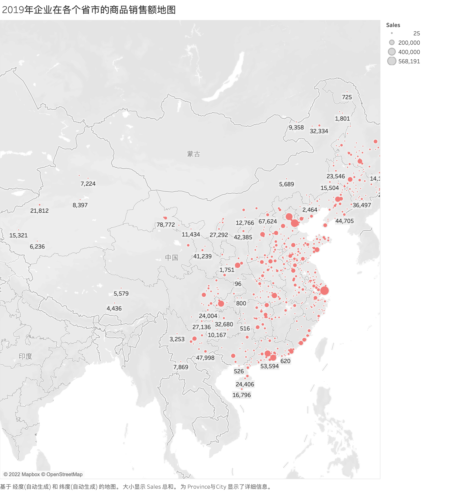
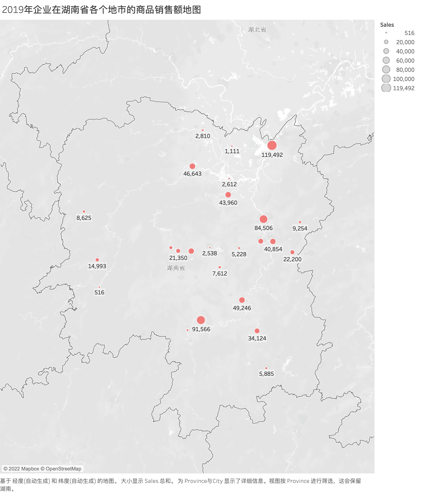
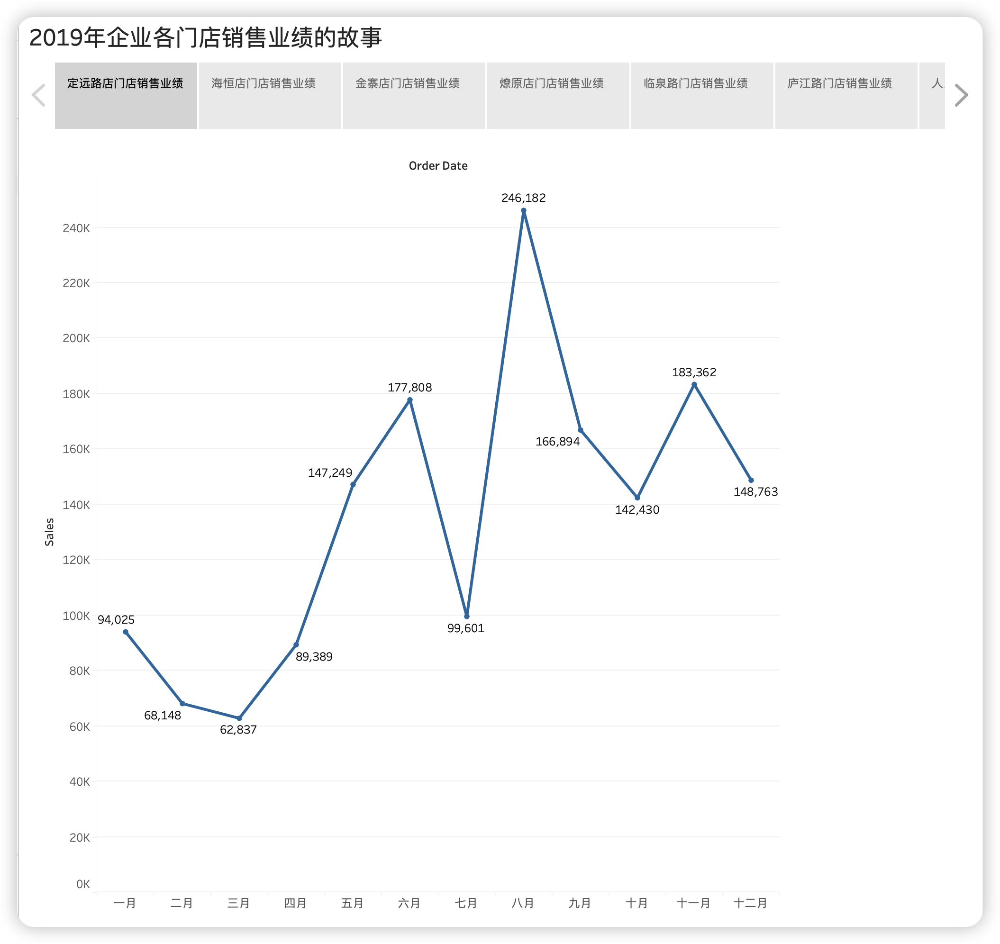
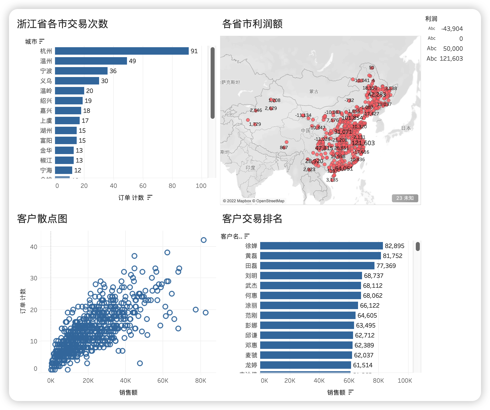

#  大数据可视化：实验二 Tableau 可视化

| 课程 | 大数据可视化 |
| ---- | ------------ |
| 学号 | 32001261     |
| 姓名 | 舒恒鑫       |
| 班级 | 计算机2004   |

## 实验内容

1. 导入商品订单表（orders.xlsx）,绘制2019年企业在各个省市的商品销售额地图。
2. 导入商品订单表（orders.xlsx）, 绘制2019年企业在湖南省各个地市的商品销售额地图。
3. 导入商品订单表（orders.xlsx）,绘制2019年企业各门店销售业绩的故事。
4. 导入数据超市运营分析.xls, 制作区域客户需求分析的仪表盘：
   1. 浙江省各市交易次数；
   2. 各省市利润额；
   3. 客户散点图；
   4. 客户交易排名；

## 实验结果和分析

### Answer01

### Answer02

### Answer03

### Answer04

