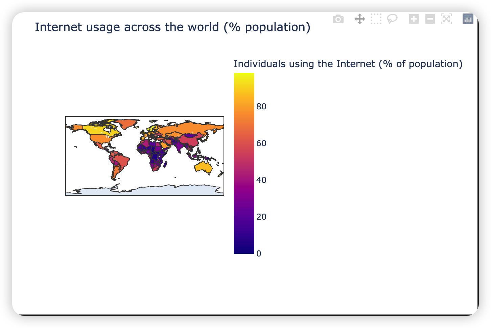
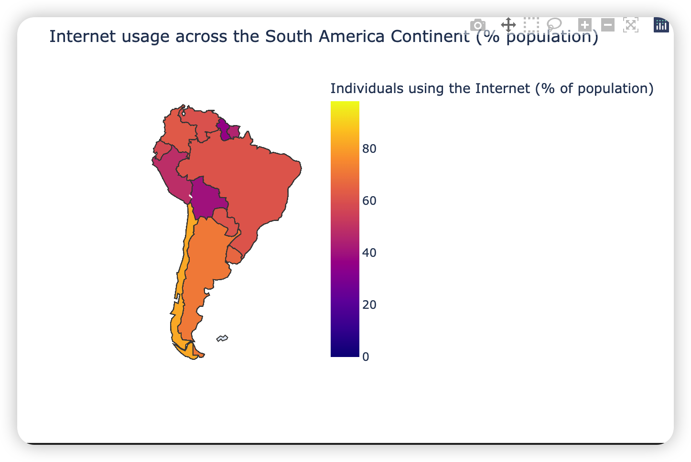
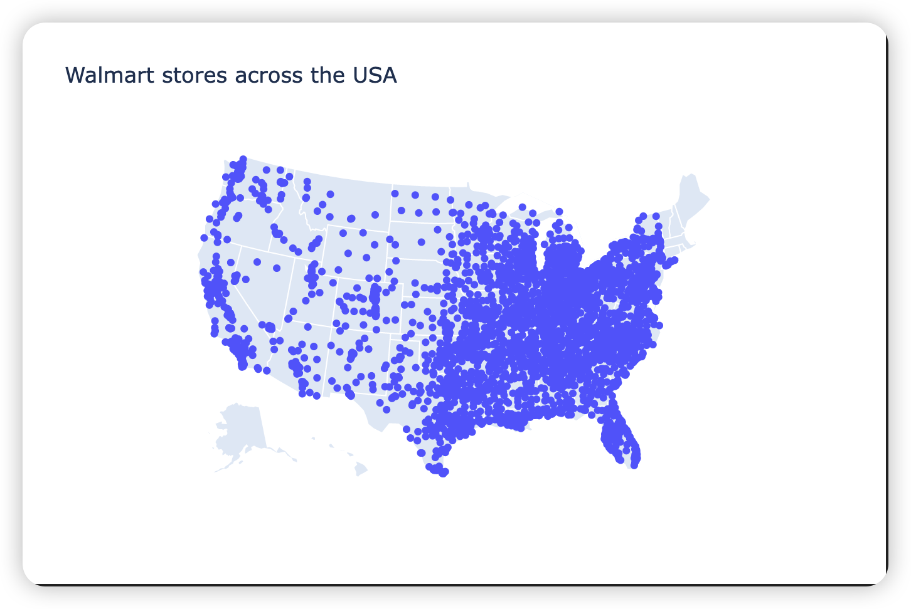
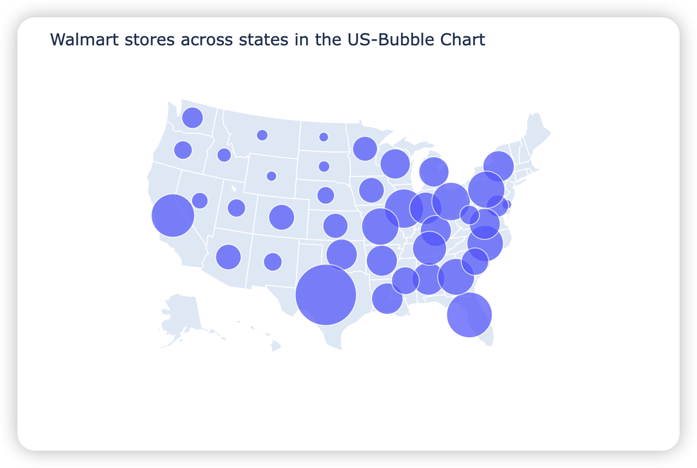
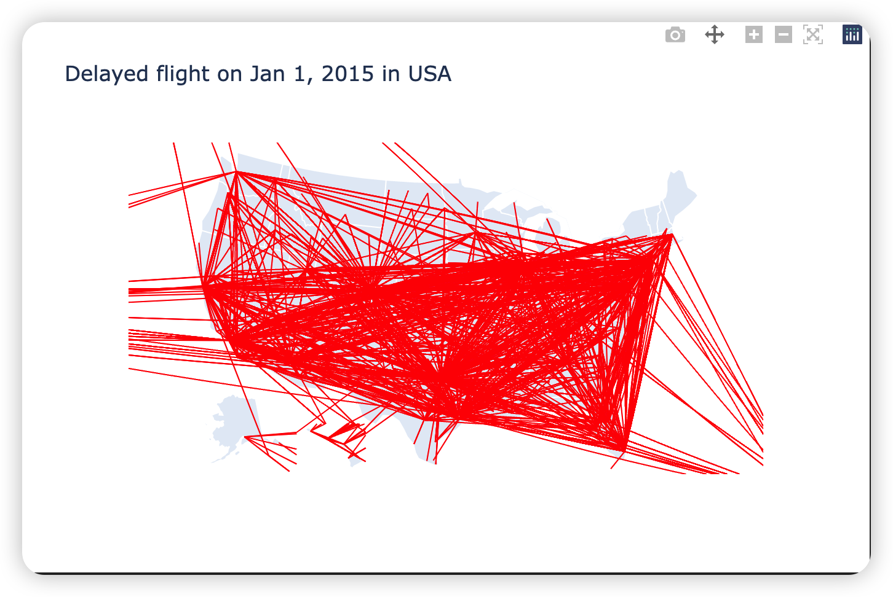

#  大数据可视化：实验六 地理时空数据可视化

| 课程 | 大数据可视化 |
| ---- | ------------ |
| 学号 | 32001261     |
| 姓名 | 舒恒鑫       |
| 班级 | 计算机2004   |

## 实验内容

- 导入数据集（share-of-individuals-using-the-internet.csv），分别绘制关于互联网使用统计的**等值线**世界地图（等量矩形投影和自然投影）和**南美地区**的等值线地图。
- 导入数据集（1962_2006_walmart_store_openings.csv），绘制关于Walmart商店在美国分布的**散点图**和各州的**气泡图**。
- 导入数据集（airports.csv，new_year_day_2015_delayed_flights.csv)，绘制2015年美国机场延误数据的**折线图**。 

## 结果分析

### 世界的互联网使用统计等值线地图

```python
import pandas as pd
import plotly
import plotly.express as px

internet_usage_df = pd.read_csv('data/share-of-individuals-using-the-internet.csv')
internet_usage_df.head(5)

fig = px.choropleth(internet_usage_df,
                    locations="Code",
                    color="Individuals using the Internet (% of population)",
                    hover_name="Country")
fig.update_layout(title_text='Internet usage across the world (% population)')

plotly.offline.plot(fig, filename='result/Internet usage across the world (% population) flat.html')
```



### 南美地区的互联网使用统计等值线地图

```python
import pandas as pd
import plotly
import plotly.express as px

internet_usage_df = pd.read_csv('data/share-of-individuals-using-the-internet.csv')
internet_usage_df.head(5)

fig = px.choropleth(
    internet_usage_df,
    locations="Code",
    color="Individuals using the Internet (% of population)",
    hover_name="Country",
    color_continuous_scale=px.colors.sequential.Plasma)

fig.update_layout(
    title_text='Internet usage across the South America Continent (% population)', geo_scope='south america')

fig.show()
plotly.offline.plot(
    fig,
    filename='result/Internet usage across the South America Continent (% population) .html')
```



### Walmart 商店在美国分布的散点图

```python
import pandas as pd
import plotly
import plotly.graph_objects as go

walmart_loc_df = pd.read_csv('data/1962_2006_walmart_store_openings.csv')
walmart_loc_df.head()

fig = go.Figure(
    data=go.Scattergeo(
        lon=walmart_loc_df['LON'],
        lat=walmart_loc_df['LAT'],
        text=walmart_loc_df['STREETADDR'],
        mode='markers'))

fig.update_layout(
    title='Walmart stores across the USA',
    geo_scope='usa',
)

fig.show()
plotly.offline.plot(
    fig,
    filename='result/Walmart stores across the USA Scatter Chart.html')
```



### Walmart 商店在美国各州的气泡图

```python
import pandas as pd
import plotly
import plotly.express as px

walmart_loc_df = pd.read_csv('data/1962_2006_walmart_store_openings.csv')
walmart_stores_by_state = walmart_loc_df.groupby('STRSTATE').count()['storenum'].reset_index().rename(
    columns={'storenum': 'NUM_STORES'})
walmart_stores_by_state.head()

fig = px.scatter_geo(
    walmart_stores_by_state,
    locations="STRSTATE",
    size="NUM_STORES",
    locationmode='USA-states',
    hover_name="STRSTATE",
    size_max=45)

fig.update_layout(
    title_text='Walmart stores across states in the US-Bubble Chart',
    geo_scope='usa'
)

fig.show()
plotly.offline.plot(
    fig,
    filename='result/Walmart stores across states in the USA Bubble Chart.html')
```



### 2015年美国机场延误数据的折线图

```python
import pandas as pd
import plotly
import plotly.graph_objects as go

us_airports_df = pd.read_csv('data/airports.csv')
us_airports_df.head()

new_year_2015_flights_df = pd.read_csv('data/new_year_day_2015_delayed_flights.csv')
new_year_2015_flights_df.head()

new_year_2015_flights_df = new_year_2015_flights_df.merge(
    us_airports_df[['IATA_CODE', 'LATITUDE', 'LONGITUDE']],
    left_on='ORIGIN_AIRPORT',
    right_on='IATA_CODE',
    how='inner')

new_year_2015_flights_df.drop(
    columns=['IATA_CODE'], inplace=True)

new_year_2015_flights_df.rename(
    columns={"LATITUDE": "ORIGIN_AIRPORT_LATITUDE",
             "LONGITUDE": "ORIGIN_AIRPORT_LONGITUDE"},
    inplace=True)

new_year_2015_flights_df.head()

new_year_2015_flights_df = new_year_2015_flights_df.merge(
    us_airports_df[['IATA_CODE', 'LATITUDE', 'LONGITUDE']],
    left_on='DESTINATION_AIRPORT',
    right_on='IATA_CODE',
    how='inner')

new_year_2015_flights_df.drop(
    columns=['IATA_CODE'], inplace=True)

new_year_2015_flights_df.rename(
    columns={'LATITUDE': 'DESTINATION_AIRPORT_LATITUDE',
             'LONGITUDE': 'DESTINATION_AIRPORT_LONGITUDE'},
    inplace=True)

new_year_2015_flights_df.head()

new_year_2015_flights_df = new_year_2015_flights_df.merge(
    us_airports_df[['IATA_CODE', 'LATITUDE', 'LONGITUDE']],
    left_on='DESTINATION_AIRPORT',
    right_on='IATA_CODE',
    how='inner')

new_year_2015_flights_df.drop(
    columns=['IATA_CODE'], inplace=True)

new_year_2015_flights_df.rename(
    columns={'LATITUDE': 'DESTINATION_AIRPORT_LATITUDE',
             'LONGITUDE': 'DESTINATION_AIRPORT_LONGITUDE'},
    inplace=True)

new_year_2015_flights_df.head()
```

