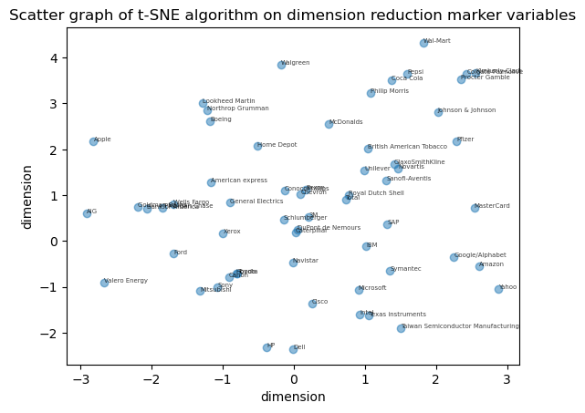
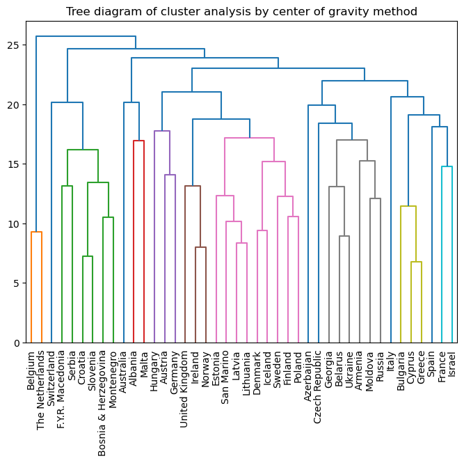
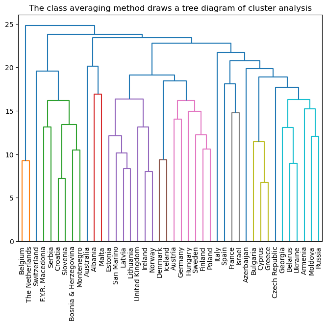
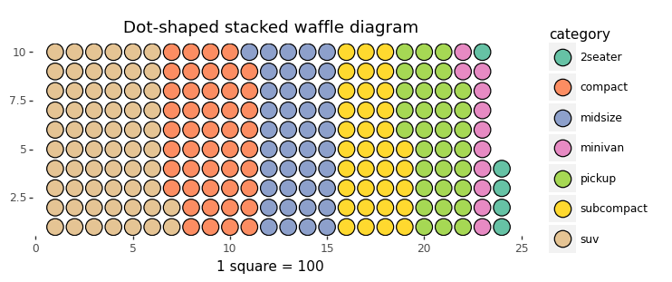
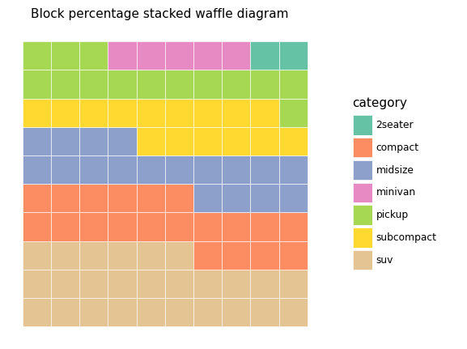
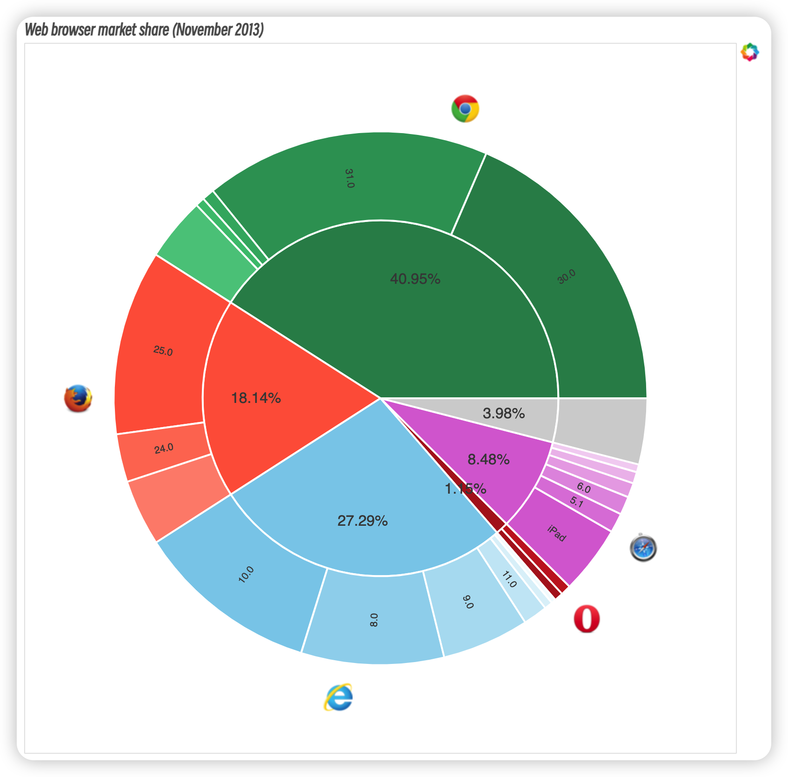

#  大数据可视化：实验八 层次数据可视化

| 课程 | 大数据可视化 |
| ---- | ------------ |
| 学号 | 32001261     |
| 姓名 | 舒恒鑫       |
| 班级 | 计算机2004   |

## 实验内容

1. 导入数据集（company-stock-movements-2010-2015-incl.csv）, 利用非线性的t-SNE算法绘制关于层次数据集数据降维标记变量的散点图，一个图。

2. 导入数据集（eurovision-2016.csv），利用的重心法（weighted)，类平均法(average)进行层次聚类分析，并绘制带聚类分析的树状图，两个图。
3. 利用函数导入plotnine的数据集mpg ，利用plotnine绘制点状堆积型和块状百分比堆积型华夫饼图，两个图。
4. 利用函数导入bokeh的数据集browsers_nov_2013,利用bokeh的Wedge和AnnularWedge函数绘制旭日图，一个图。

## 实验结果

### 非线性的t-SNE算法绘制关于层次数据集数据降维标记变量的散点图

### 聚类分析的树状图

**重心法绘制聚类分析的树状图**

**类平均法绘制聚类分析的树状图**

### plotnine 绘制华夫饼图

**点状堆积型华夫饼图**

**块状百分比堆积型华夫饼图**

### 利用 bokeh 的 Wedge 和 AnnularWedge 函数绘制旭日图

