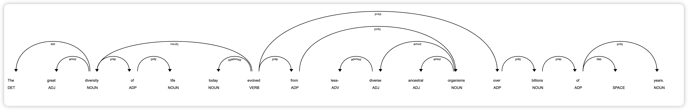
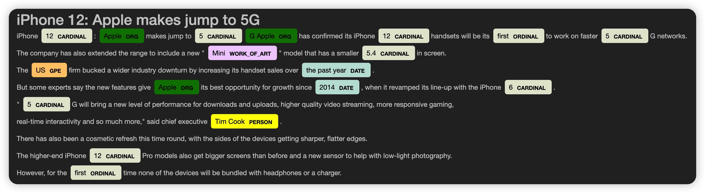
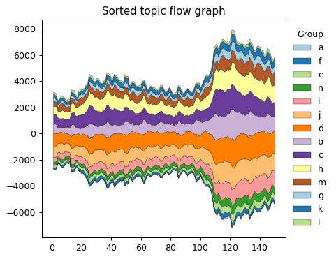

# 大数据可视化：实验十 文本数据可视化

| 课程 | 大数据可视化 |
| ---- | ------------ |
| 学号 | 32001261     |
| 姓名 | 舒恒鑫       |
| 班级 | 计算机2004   |

## 实验内容

1. 利用Spacy包，对long_text实现文本依赖性分析可视化（Text dependency sparse visualization），一个图。

1. 利用Spacy包，分别载入en_core_web_sm和zh_core_web_sm, 对Solving  Mehtods.txt 和中国女排.txt, 实现文本命名实体的可视化（Text named titled visualization），两个图。

1. 导入数据集（Tagore.txt）, 利用wordcloud和图片IndiaMap.jpg，分别绘制基于背景图片的黑色背景英文词云图，一个图。

1. 导入数据集（WordCloud_Chinese.txt'），利用wordcloud，jieba和图片WordCloud_Image.jpg，更新中文停止词为    ['可以','这个','虽然','因为','这样','已经','现在','一些']，生成白色背景的中文词云图，一个图。

1. 导入数据集（StreamGraph_Data.csv）, 利用matplotlib.pyplot函数绘制按最大值排序后的主题流图，一个图。

## 实验结果

### 文本依赖性分析可视化

### 文本命名实体可视化

#### en_core_web_sm

#### zh_core_web_sm

### 基于背景图片的黑色背景英文词云图

### 白色背景的中文词云图

### 按最大值排序后的主题流图

