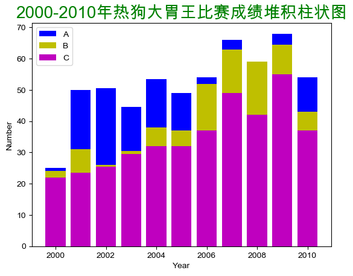
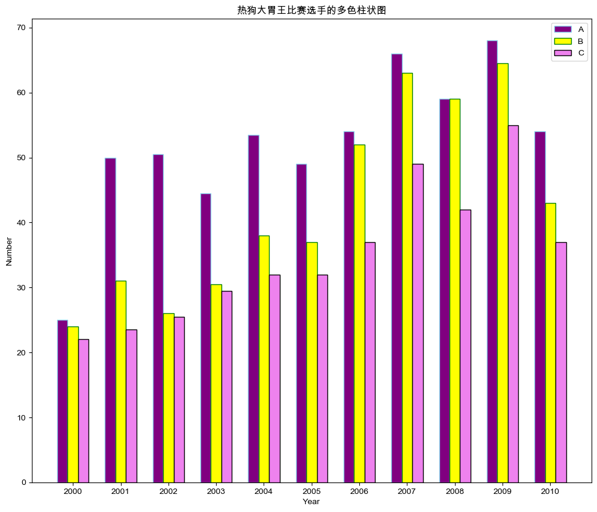
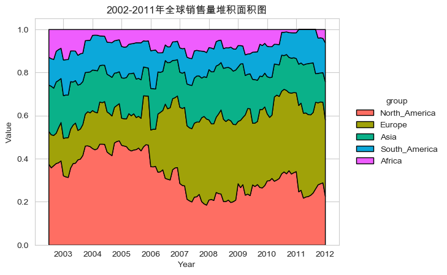
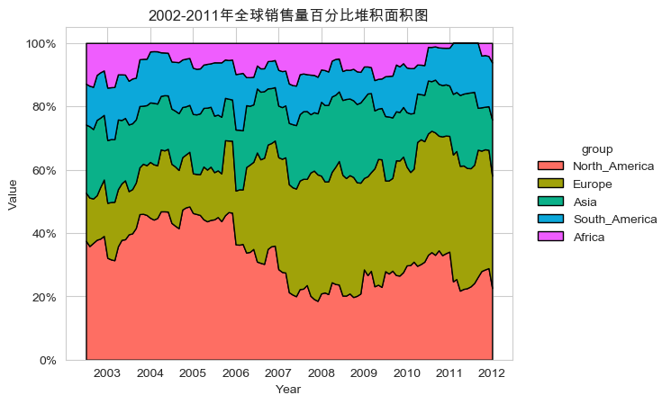
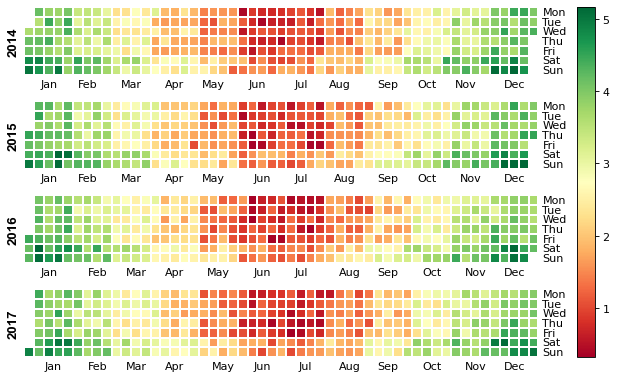
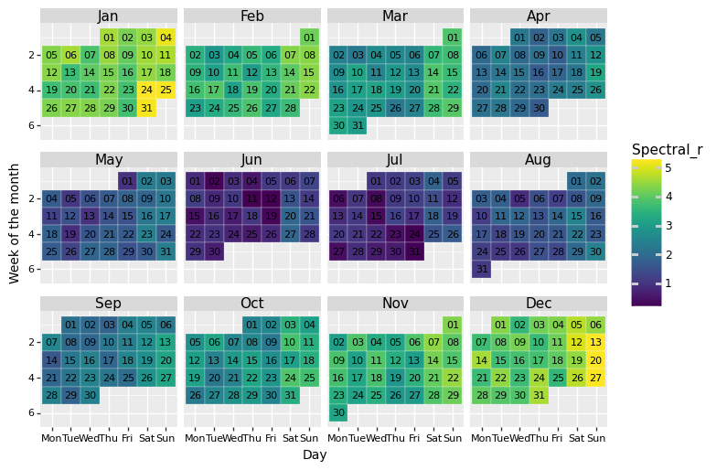
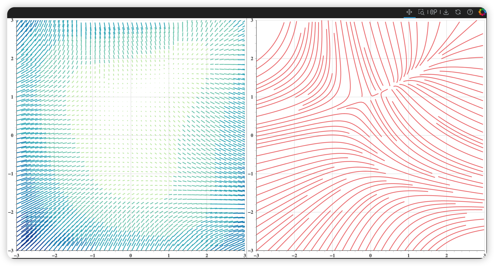

#  大数据可视化：实验五 时间和矢量场数据可视化

| 课程 | 大数据可视化 |
| ---- | ------------ |
| 学号 | 32001261     |
| 姓名 | 舒恒鑫       |
| 班级 | 计算机2004   |

## 实验内容

1. 导入数据集（hot-dog-places.csv）分别绘制关于热狗大胃王比赛的选手的堆积柱状图和多色柱状图
2. 导入数据集（SaleStackedArea_Data.csv）绘制2002-2011年全球销售量堆积面积图和百分比堆积面积图
3. 导入数据集（Calerdar.csv）绘制以年为单位的日历图和2015年以月为单位的日历图
4. 利用数值积分方法（如Runge-Kutta法）绘制二维矢量场可视化的脉线图

## 结果分析

### Answer01

**热狗大胃王比赛的选手的堆积柱状图**

```python
plt.bar(x, y1, align="center", color="b",label='A')
plt.bar(x, y2, align="center", color="y",label='B')
plt.bar(x, y3, align="center", color="m",label='C')
plt.legend()
plt.title('2000-2010年热狗大胃王比赛成绩堆积柱状图', size=20, color='g', loc='center')
```



**热狗大胃王比赛选手的多色柱状图**

```python
import numpy as np

barWid = 0.22
fig = plt.subplots(figsize=(12, 10))

co1 = reader['A']
co2 = reader['B']
co3 = reader['C']

co1bar = np.arange(len(x))
co2bar = [x - barWid for x in co1bar]
co3bar = [x - 2 * barWid for x in co1bar]

plt.bar(co3bar, co1, color='purple', width=barWid, edgecolor='skyblue', label='A')
plt.bar(co2bar, co2, color='yellow', width=barWid, edgecolor='green', label='B')
plt.bar(co1bar, co3, color='violet', width=barWid, edgecolor='black', label='C')

plt.xlabel('Year', fontweight='bold')
plt.ylabel('Number', fontweight='bold')
plt.xticks([r - barWid for r in range(len(x))], x)

plt.title('热狗大胃王比赛选手的多色柱状图')
plt.legend()
plt.show()
```



### Answer02

**2002-2011年全球销售量堆积面积图**

```python
fig = plt.figure()
plt.stackplot(df.index.values,
              df.values.T, alpha=1, labels=columns, linewidth=1, edgecolor='k', colors=colors)
plt.title('2002-2011年全球销售量堆积面积图')
plt.xlabel("Year")
plt.ylabel("Value")
plt.legend(title="group", loc="center right", bbox_to_anchor=(1.35, 0, 0, 1), edgecolor='none', facecolor='none')
plt.show()
```



**2002-2011年全球销售量百分比堆积面积图**

```python
plt.stackplot(df.index.values, df.values.T, labels=columns, colors=colors,
              linewidth=1, edgecolor='k')

plt.title('2002-2011年全球销售量百分比堆积面积图')
plt.xlabel("Year")
plt.ylabel("Value")
plt.gca().set_yticklabels(['{:.0f}%'.format(x * 100) for x in plt.gca().get_yticks()])
plt.legend(title="group", loc="center right", bbox_to_anchor=(1.5, 0, 0, 1), edgecolor='none', facecolor='none')
plt.show()
```



### Answer03

**以年为单位的日历图**

```python
df = pd.read_csv('data/Calendar.csv', parse_dates=['date'])
df.set_index('date', inplace=True)

fig, ax = calmap.calendarplot(df['value'], fillcolor='grey',
                              linecolor='w', linewidth=0.1, cmap='RdYlGn',
                              yearlabel_kws={'color': 'black', 'fontsize': 12},
                              fig_kws=dict(figsize=(10, 5), dpi=80))
fig.colorbar(ax[0].get_children()[1], ax=ax.ravel().tolist())
plt.show()
```



**2015年以月为单位的日历图**

```python
from plotnine import *

base_plot = (ggplot(df, aes('weekdayf', 'monthweek', fill='value')) +
             geom_tile(colour="white", size=0.1) +
             scale_fill_cmap(name='Spectral_r') +
             geom_text(aes(label='day'), size=8) +
             facet_wrap('~monthf', nrow=3) +
             scale_y_reverse() +
             xlab("Day") + ylab("Week of the month") +
             theme(strip_text=element_text(size=11, face="plain", color="black"),
                   axis_title=element_text(size=10, face="plain", color="black"),
                   axis_text=element_text(size=8, face="plain", color="black"),
                   legend_position='right',
                   legend_background=element_blank(),
                   aspect_ratio=0.85,
                   figure_size=(8, 8),
                   dpi=100
                   ))
print(base_plot)
```



### Answer04

**二维矢量场可视化的脉线图**

```python
xx = np.linspace(-3, 3, 100)
yy = np.linspace(-3, 3, 100)
Y, X = np.meshgrid(xx, yy)

U = -1 - X ** 2 + Y
V = 1 + X - Y ** 2

speed = np.sqrt(U * U + V * V)
theta = np.arctan(V / U)

x0 = X[::2, ::2].flatten()
y0 = Y[::2, ::2].flatten()

length = speed[::2, ::2].flatten() / 40
angle = theta[::2, ::2].flatten()

x1 = x0 + length * np.cos(angle)
y1 = y0 + length * np.sin(angle)

xs, ys = streamlines(xx, yy, U.T, V.T, density=2)
cm = np.array(["#C7E9B4", "#7FCDBB", "#41B6C4", "#1D91C0", "#225EA8", "#0C2C84"])
ix = ((length - length.min()) / (length.max() - length.min()) * 5).astype('int')
colors = cm[ix]

p1 = figure(x_range=(-3, 3), y_range=(-3, 3))
p1.segment(x0, y0, x1, y1, color=colors, line_width=2)
p2 = figure(x_range=p1.x_range, y_range=p1.y_range)
p2.multi_line(xs, ys, color="#ee6666", line_width=2, line_alpha=0.8)
```

