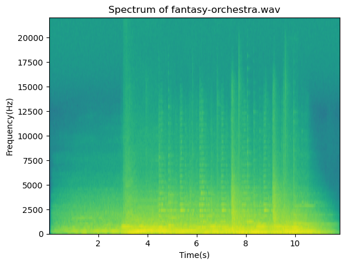
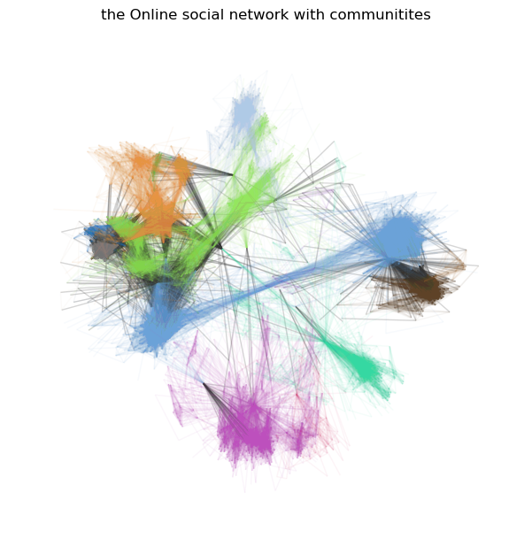
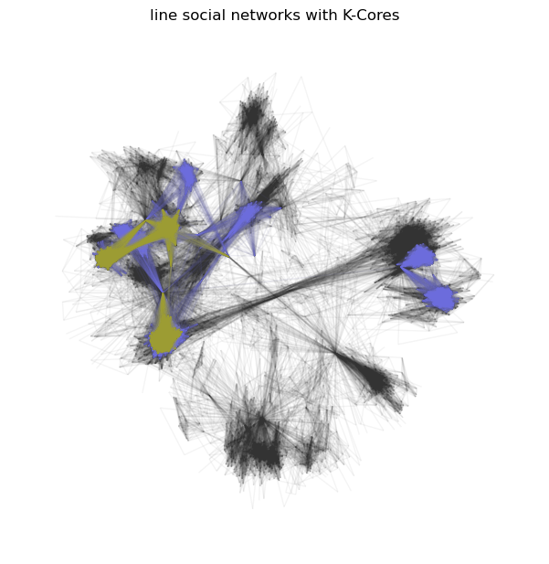
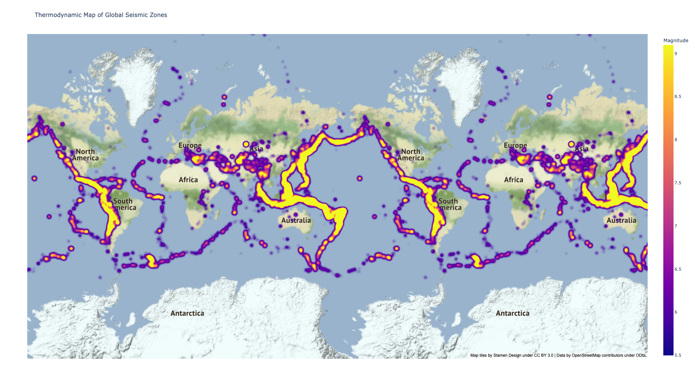
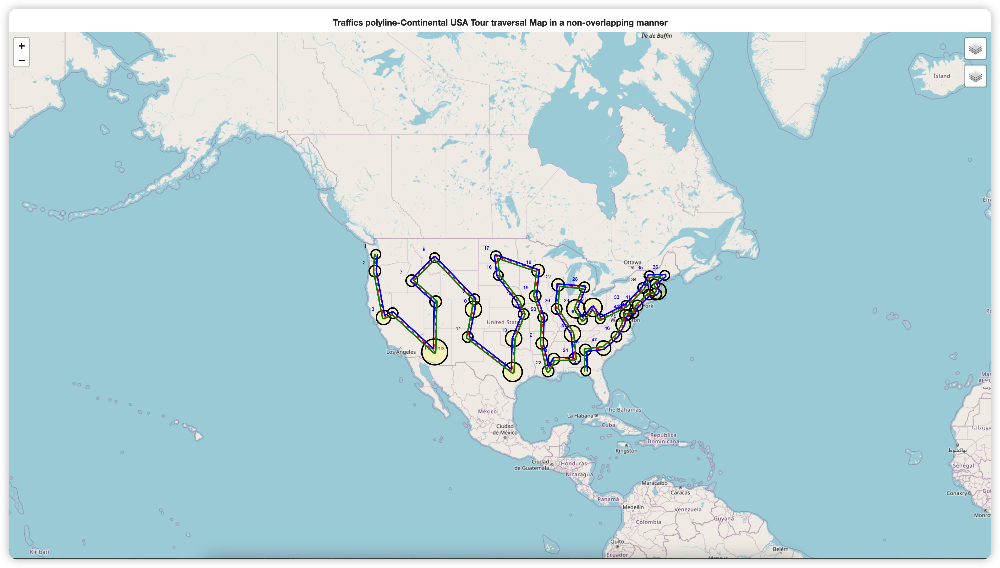

# 大数据可视化：实验十一 社交和日志数据可视化

| 课程 | 大数据可视化 |
| ---- | ------------ |
| 学号 | 32001261     |
| 姓名 | 舒恒鑫       |
| 班级 | 计算机2004   |

## 实验内容

1. 导入音频（fantasy-orchestra.wav），利用wave和matplotlib包，绘制频谱图，一个图。

2. 导入数据集（facebook_combined.txt）, 利用networkx.algorithms.community包和matplotlib 包，分别绘制具有社区结构模式和K-中心模式的社交数据网络结构图，两个图。

3. 导入数据集（earthquakes-23k.csv），利用plotly包来绘制全球地震带热力图，一个图。
4.  利用folium包中的 folium.plugins函数，来绘制分别在美国旅游的地图信息轨迹图，要求以stamenwatercolor作为地图背景，一个图。

## 实验结果

### 频谱图

### 社交数据网络结构图

#### 具有社区结构模式的社交数据网络结构图

#### K-中心模式的社交数据网络结构图

### 全球地震带热力图

### 美国旅游的地图信息轨迹图

