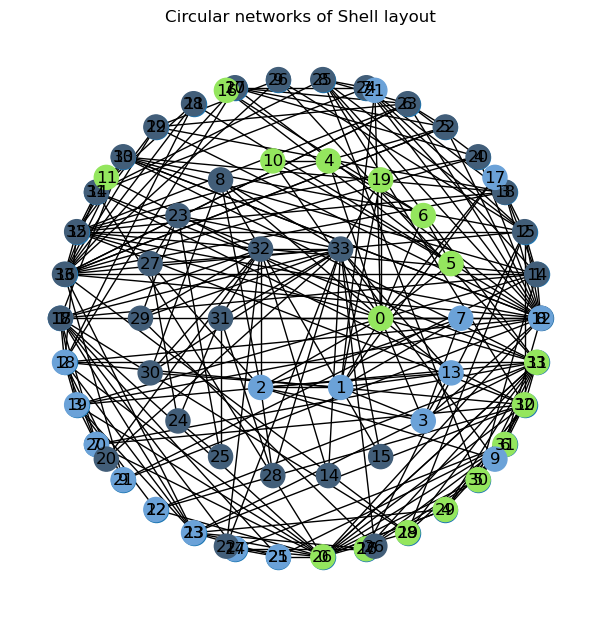
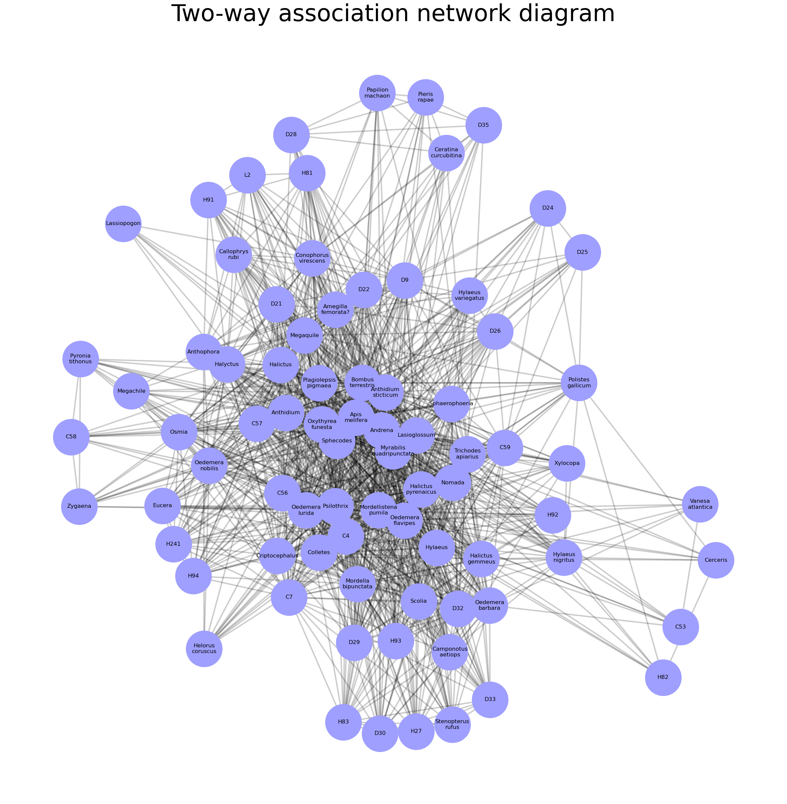
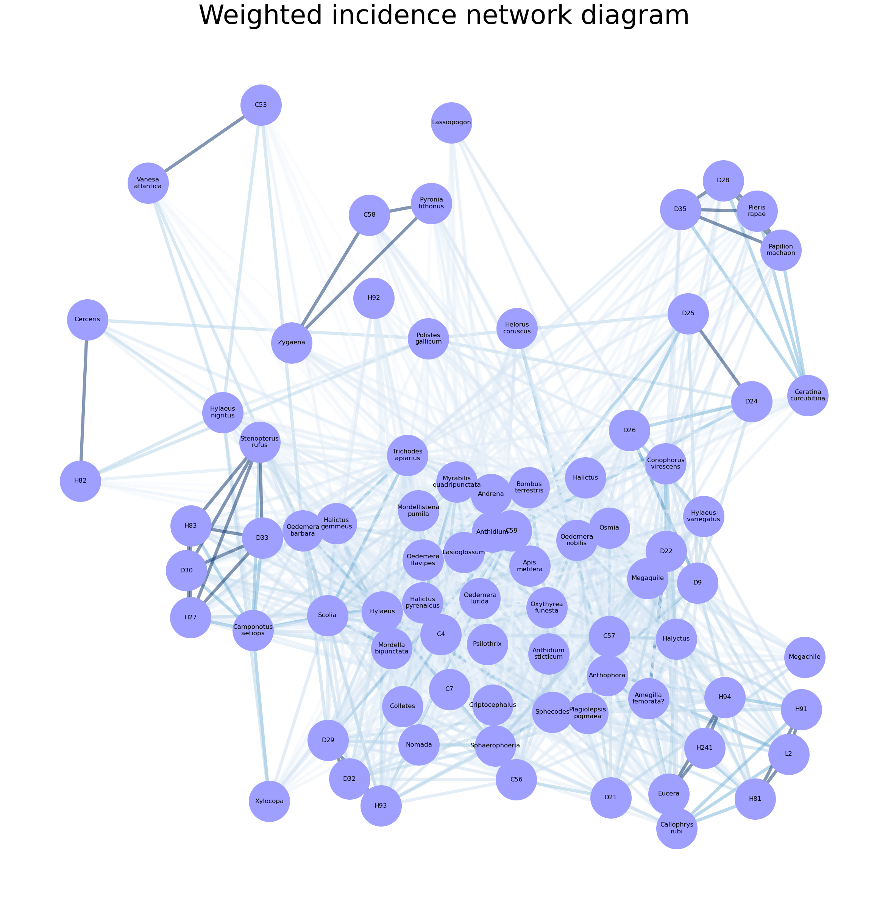
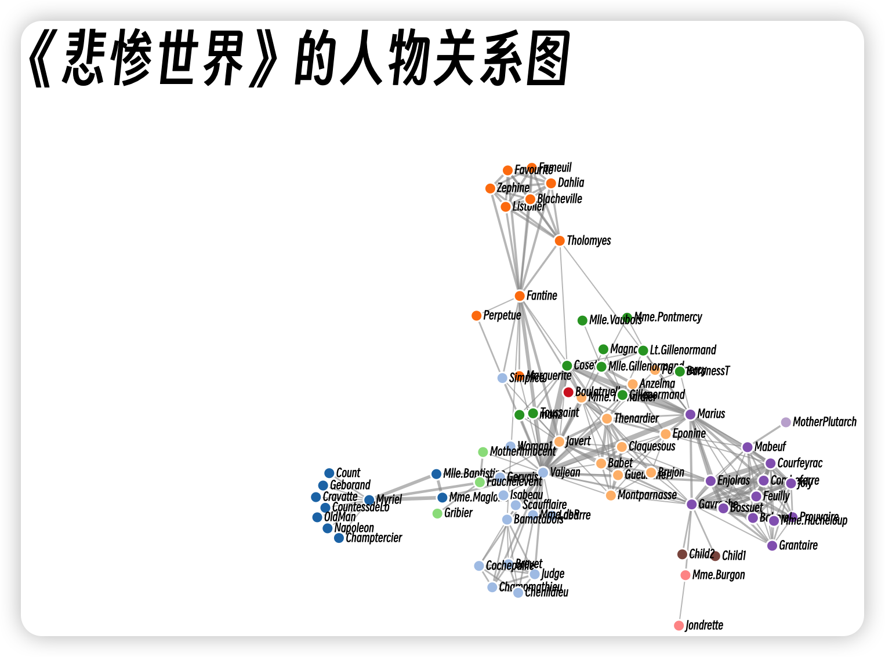
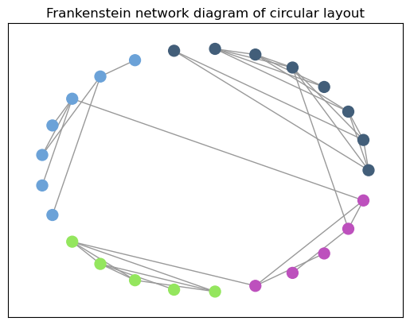
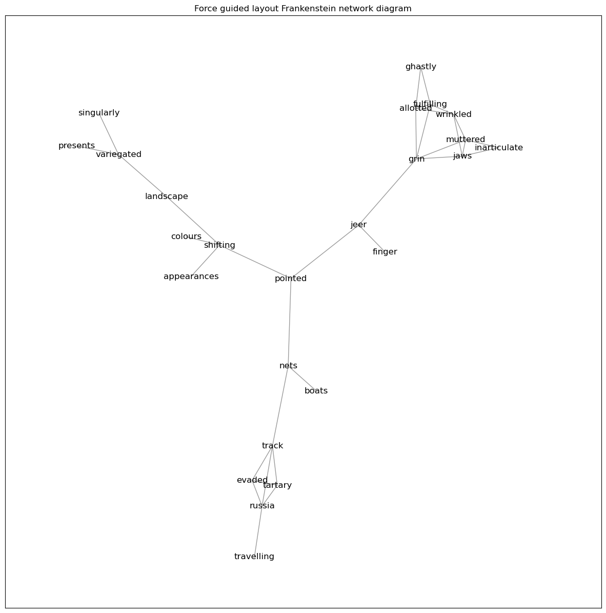

# 大数据可视化：实验九 网络数据可视化

| 课程 | 大数据可视化 |
| ---- | ------------ |
| 学号 | 32001261     |
| 姓名 | 舒恒鑫       |
| 班级 | 计算机2004   |

## 实验内容

1. 利用 networkx 和 matplotlib 绘制圆形网壳布局图(Circular networks of Shell layout)，一个图。

2. 导入数据集（Bartomeus_Ntw_nceas.txt），利用networkx，绘制植物与授粉者的双向关联网图和植物和授粉者加权关联网图，两个图。
3.  导入数据集（miserables.JSON)，利用D3, 结合力引导算法，生成《悲惨世界》的人物关系图，一个图。
4. 导入数据集（frankenstein.txt），利用networkx.algorithms.community包，结合力引导算法，绘制阙值后的圆形布局弗兰肯斯坦网络图和力引导布局弗兰肯斯坦网络图，两个图。

## 实验结果

### 绘制圆形网壳布局图

### 绘制关联网图

#### 植物与授粉者的双向关联网图

#### 植物和授粉者加权关联网图

### 绘制《悲惨世界》的人物关系图

### 圆形布局弗兰肯斯坦网络图与力引导布局弗兰肯斯坦网络图

#### 圆形布局弗兰肯斯坦网络图

#### 力引导布局弗兰肯斯坦网络图

