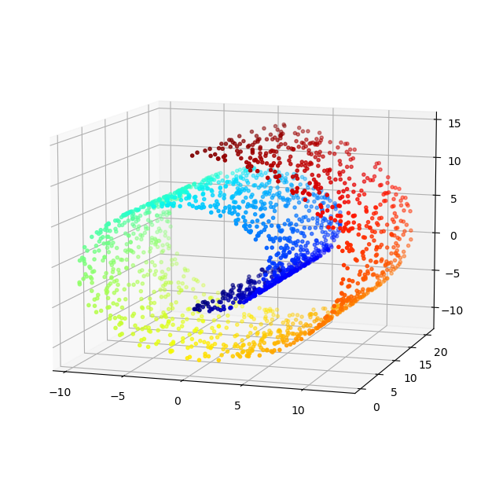
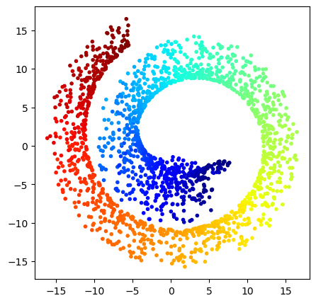
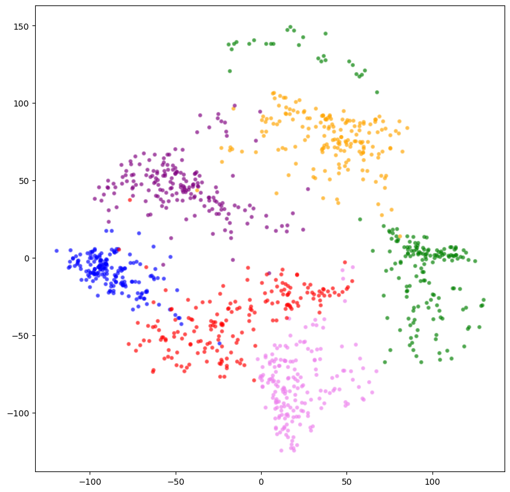
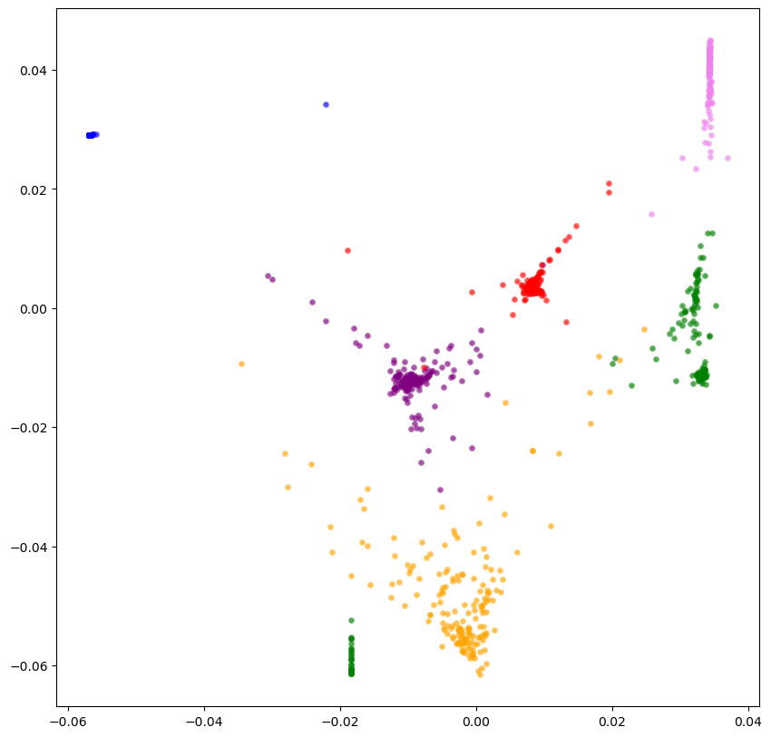
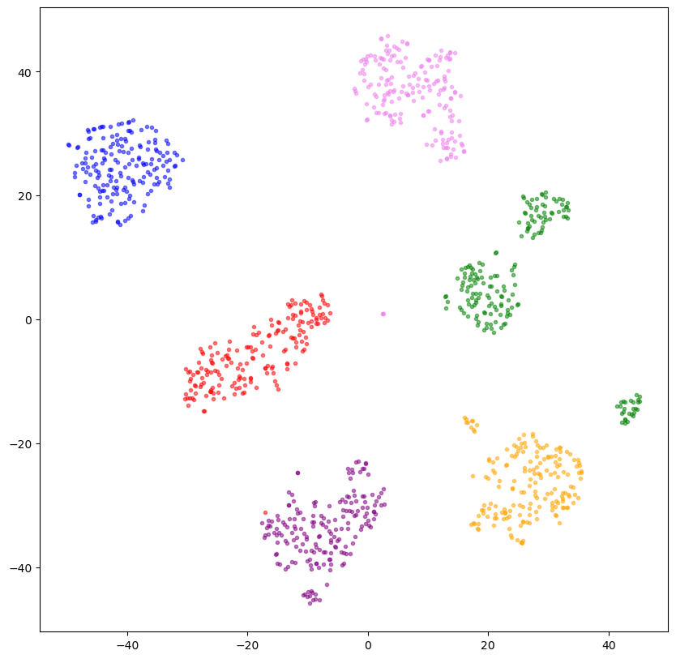
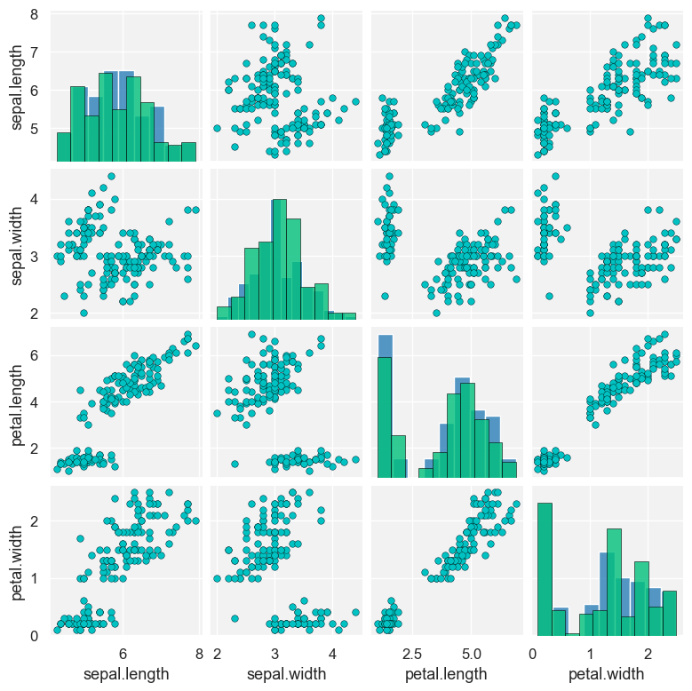
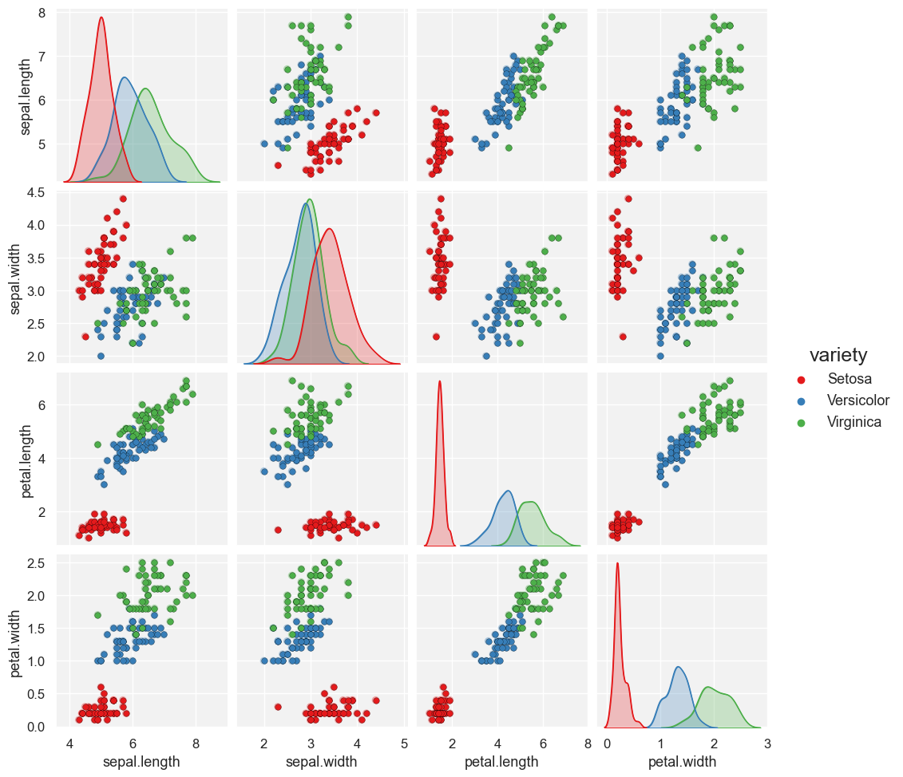
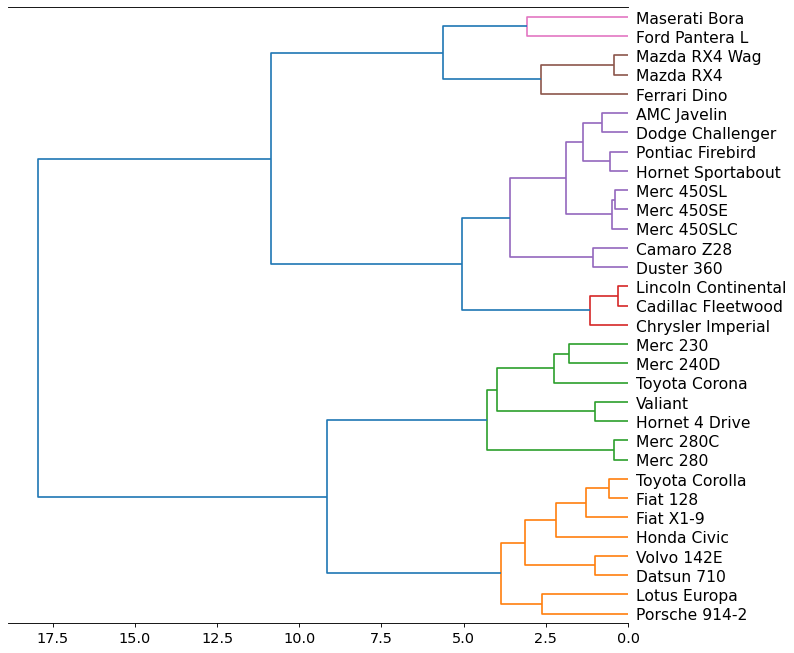
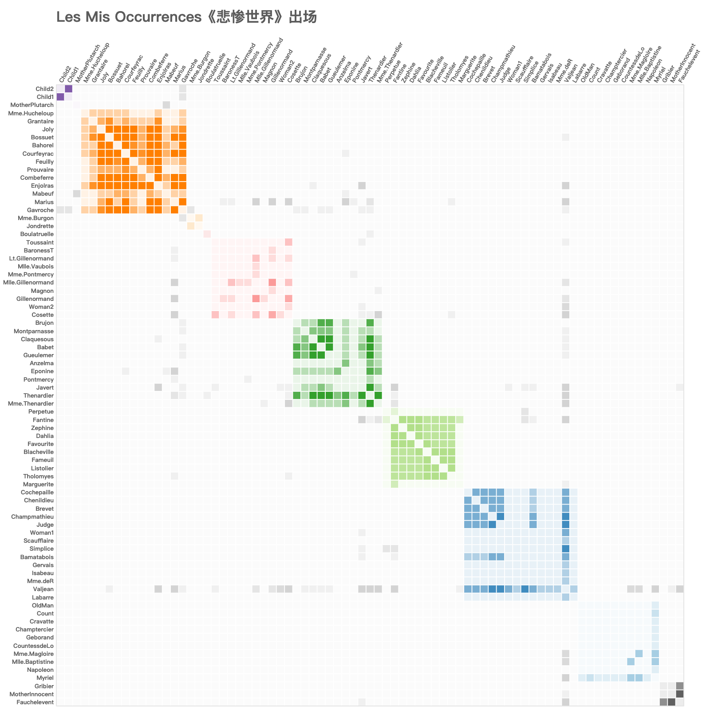

#  大数据可视化：实验七 高维非空间数据可视化

| 课程 | 大数据可视化 |
| ---- | ------------ |
| 学号 | 32001261     |
| 姓名 | 舒恒鑫       |
| 班级 | 计算机2004   |

## 实验内容

- 导入数据集（Mnist）, 分别利用线性的**多维尺度分析（MDS）**方法和非线性的**ISOMAP（等距映射），LLE（局部线性嵌入），t-SNE（随机邻域嵌套）算法**绘制关于784维的image数据变换展示（数据降维）**四个图**。
- 导入数据集（iris.csv），绘制关于以**sepal.width**作为变量的基于点方法的多数据系列 **矩阵散点图，一个图**。
- 利用函数导入lotnine.data 中数据集mtcars，利用SCiPy包中的dendrogram（)函数绘制基于线方法的**横向树形图，一个图**。
- 利用函数导入bokeh的数据集bokeh.sampledata.les_mis ，利用bokeh绘制基于区域方法的**色块图，一个图**。

## 实验结果

### Mnist 数据变换展示

**线性的多维尺度分析（MDS）**

**非线性的ISOMAP（等距映射）**

**LLE（局部线性嵌入）**

**t-SNE（随机邻域嵌套）算法**

### 矩阵散点图

**单数据系列**

**多数据系列**

### 树形图

**横向树形图**

****

**纵向树形图**

### 色块图

